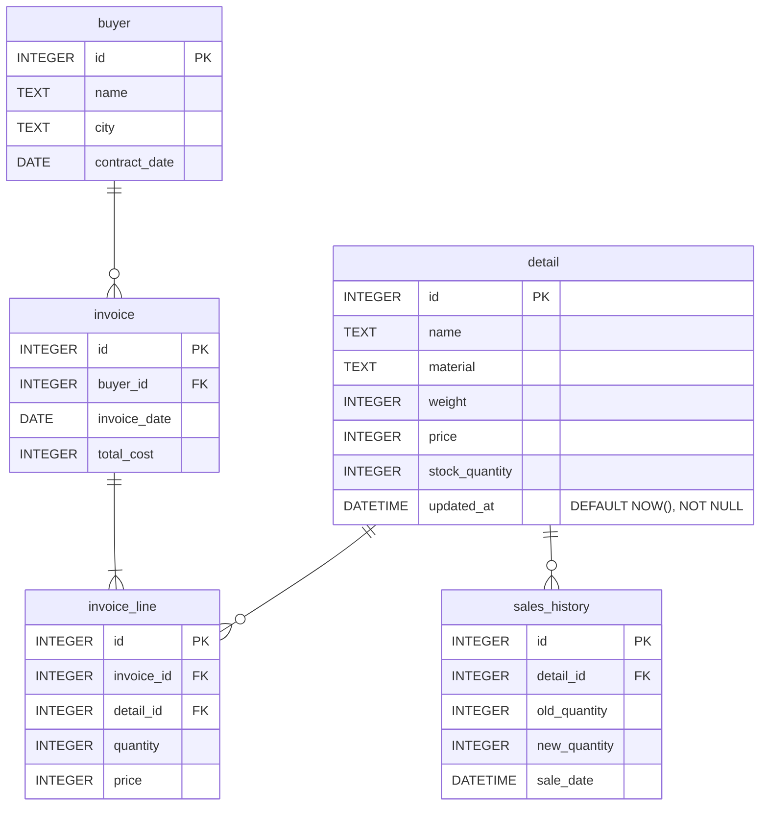

```mermaid
erDiagram
    detail {
        INTEGER id PK
        TEXT name
        TEXT material
        INTEGER weight
        INTEGER price
        INTEGER stock_quantity

        DATETIME updated_at "DEFAULT NOW(), NOT NULL"
    }

    buyer {
        INTEGER id PK
        TEXT name
        TEXT city
        DATE contract_date
    }

    invoice {
        INTEGER id PK
        INTEGER buyer_id FK
        DATE invoice_date
        INTEGER total_cost
    }

    invoice_line {
        INTEGER id PK
        INTEGER invoice_id FK
        INTEGER detail_id FK
        INTEGER quantity
        INTEGER price
    }

    sales_history {
        INTEGER id PK
        INTEGER detail_id FK
        INTEGER old_quantity
        INTEGER new_quantity
        DATETIME sale_date
    }

    buyer ||--o{ invoice: ""

    invoice ||--|{ invoice_line: ""

    detail ||--o{ invoice_line: ""
    detail ||--o{ sales_history: ""
```

