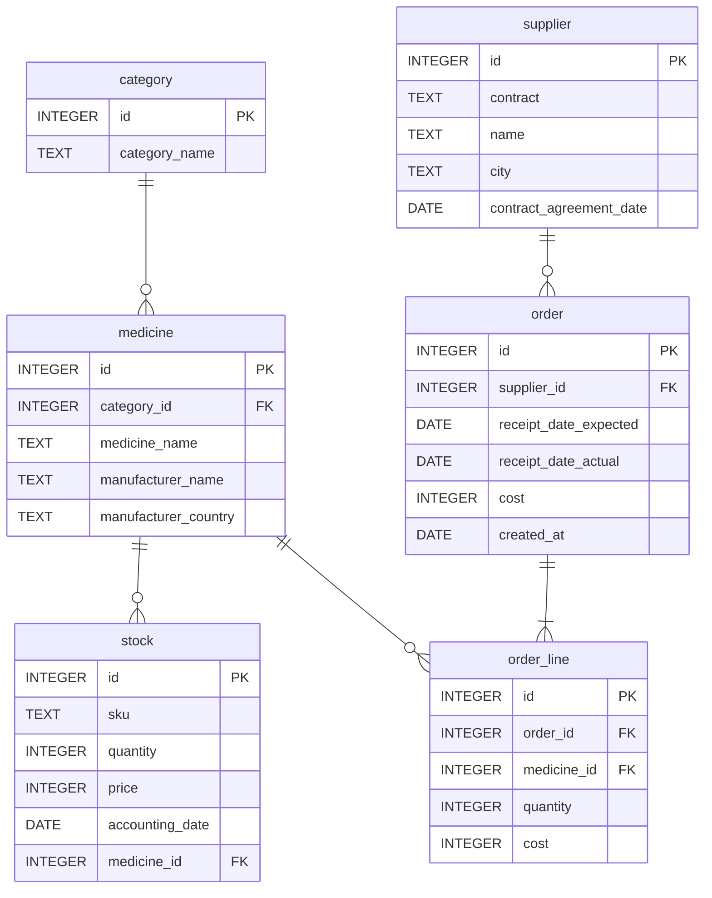

```mermaid
erDiagram
    category {
        INTEGER id PK
        TEXT category_name
    }

    medicine {
        INTEGER id PK
        INTEGER category_id FK
        TEXT medicine_name
        TEXT manufacturer_name
        TEXT manufacturer_country
    }

    supplier {
        INTEGER id PK
        TEXT contract
        TEXT name
        TEXT city
        DATE contract_agreement_date
    }

    order {
        INTEGER id PK
        INTEGER supplier_id FK
        DATE receipt_date_expected
        DATE receipt_date_actual
        INTEGER cost
        DATE created_at
    }

    order_line {
        INTEGER id PK
        INTEGER order_id FK
        INTEGER medicine_id FK
        INTEGER quantity
        INTEGER cost
    }

    stock {
        INTEGER id PK
        TEXT sku
        INTEGER quantity
        INTEGER price
        DATE accounting_date
        INTEGER medicine_id FK
    }

    category ||--o{ medicine: ""

    medicine ||--o{ stock: ""
    medicine ||--o{ order_line: ""

    supplier ||--o{ order: ""

    order ||--|{ order_line: ""
```
